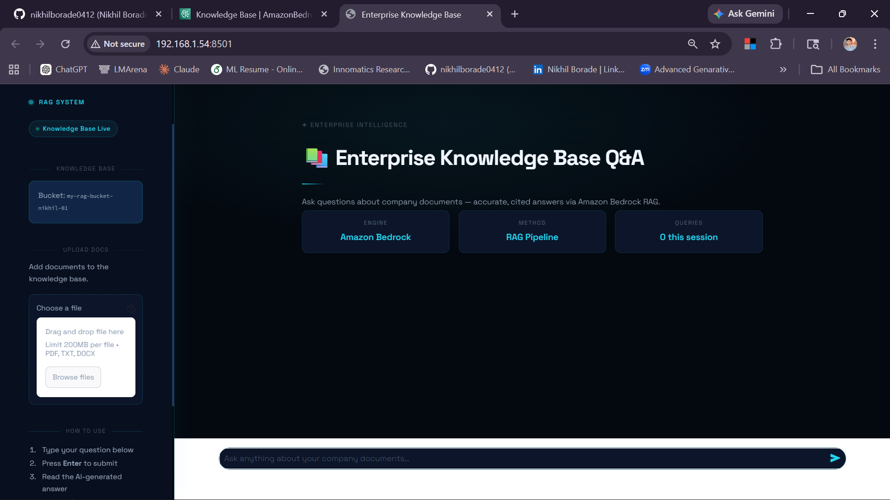

# 🚀 Enterprise RAG Q&A System
### Retrieval-Augmented Generation using Amazon Bedrock

An AI-powered **Document Question Answering System** that uses **RAG (Retrieval-Augmented Generation)** to provide accurate, citation-based answers from your internal documents.

---
## 🖼️ Application Preview



---

## 📌 Project Overview

This project enables users to:

- Ask questions in natural language
- Get accurate answers from internal/company documents
- View citations for transparency
- Upload new documents dynamically
- Deploy the system on AWS for real-time usage

---

## 🧠 What is RAG?

**RAG (Retrieval-Augmented Generation)** combines retrieval and generation:

```

User Question
↓
Convert to Embedding
↓
Search Vector Database
↓
Retrieve Relevant Documents
↓
Send to LLM (Nova Lite)
↓
Generate Answer + Citations

```

✔ Without RAG → AI may hallucinate  
✔ With RAG → AI answers from your documents (accurate & reliable)

---

## 🛠️ Tech Stack

- Python 3.9+
- Streamlit
- Amazon Bedrock
- Amazon S3
- OpenSearch Serverless
- Titan Embeddings
- Nova Lite (LLM)
- AWS EC2
- boto3

---

## 📁 Project Structure

```

ENTERPRISE-RAG-SYSTEM/
│
├── **pycache**/
├── .streamlit/
│
├── documents/
│   └── company_policy.txt
│
├── images/
│   └── img.png
│
├── myenv/
│
├── scripts/
│   ├── **pycache**/
│   ├── deploy_ec2.sh
│   └── setup_s3.py
│
├── .env
├── app.py
├── bedrock_rag.py
├── config.py
├── README.md
├── requirements.txt

````

---

## ⚙️ Setup Instructions

### 1️⃣ Clone Repository

```bash
git clone https://github.com/your-username/enterprise-rag-system.git
cd enterprise-rag-system
````

---

### 2️⃣ Create Virtual Environment

```bash
python -m venv myenv
myenv\Scripts\activate   # Windows
```

---

### 3️⃣ Install Dependencies

```bash
pip install -r requirements.txt
```

---

### 4️⃣ Configure Environment Variables

Create `.env` file:

```env
AWS_ACCESS_KEY_ID=your_access_key
AWS_SECRET_ACCESS_KEY=your_secret_key
AWS_DEFAULT_REGION=us-east-1
```

---

### 5️⃣ Update config.py

```python
AWS_REGION = "us-east-1"
S3_BUCKET_NAME = "your-bucket-name"
KNOWLEDGE_BASE_ID = "your_kb_id"
MODEL_ARN = "amazon.nova-lite"
```

---

### 6️⃣ Run the Application

```bash
streamlit run app.py
```

👉 Open in browser:
[http://localhost:8501](http://localhost:8501)

---

## 📤 Upload Documents

### Option 1: From UI

* Use sidebar upload option
* Click **Sync in Bedrock**

### Option 2: Using Script

```bash
python scripts/setup_s3.py
```

⚠️ Important: Always **Sync in Bedrock after upload**

---

## ☁️ Deploy on AWS EC2

### Run on EC2:

```bash
nohup streamlit run app.py \
--server.port 8501 \
--server.address 0.0.0.0 &
```

### Access App:

```
http://YOUR_EC2_PUBLIC_IP:8501
```

---

## ✨ Features

* 🔍 Semantic Search
* 🤖 AI-powered answers
* 📄 Citation-based responses
* 📂 Dynamic document upload
* ☁️ Cloud deployment (AWS)

---

## ❗ Common Errors & Fixes

| Error              | Solution                  |
| ------------------ | ------------------------- |
| NoCredentialsError | Check `.env` file         |
| AccessDenied       | Fix IAM permissions       |
| No citations       | Sync documents in Bedrock |
| App not opening    | Allow port 8501 in EC2    |

---

## 🔄 Workflow

```
User → Streamlit UI → Bedrock → OpenSearch → LLM → Answer
```

---

## 👨‍💻 Author

**Pruthviraj Patil **
AI/ML Developer | Data Science Enthusiast

---

## ⭐ Support

If you like this project, give it a ⭐ on GitHub!

---

## 📜 License

This project is licensed under the MIT License.

---

💡 Built with ❤️ using Python, Streamlit & AWS

```
